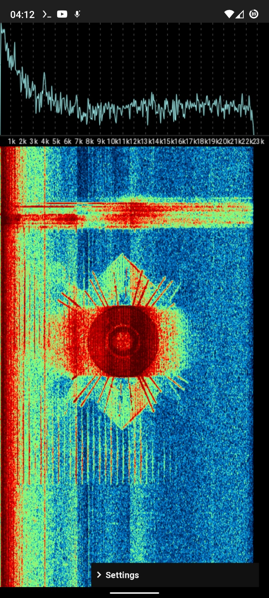
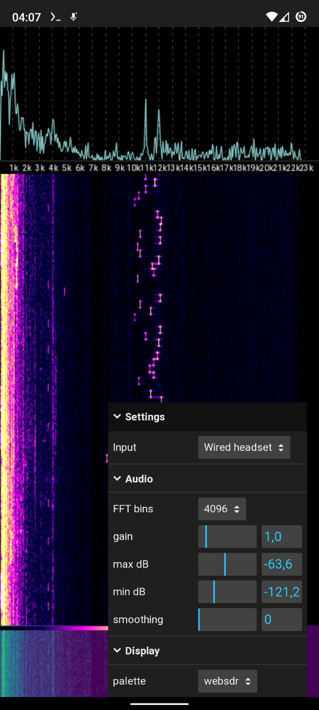
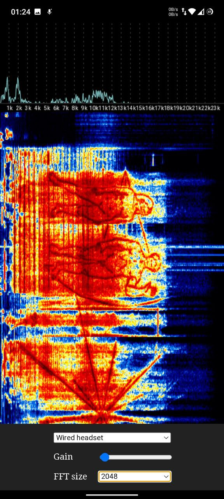

# audio-analyzer

Audio spectrum analyzer.

Features:

- simple and fast
- web version
- input gain change
- analyser range in decibels
- FFT bins count
- tons of waterfall themes

App here: [https://fagci.github.io/audio-analyzer/](https://fagci.github.io/audio-analyzer/)

Sound to test: [https://www.youtube.com/watch?v=FnzIpAAzP3w](https://www.youtube.com/watch?v=FnzIpAAzP3w)

## Usage

Select device first and allow access to it =)
